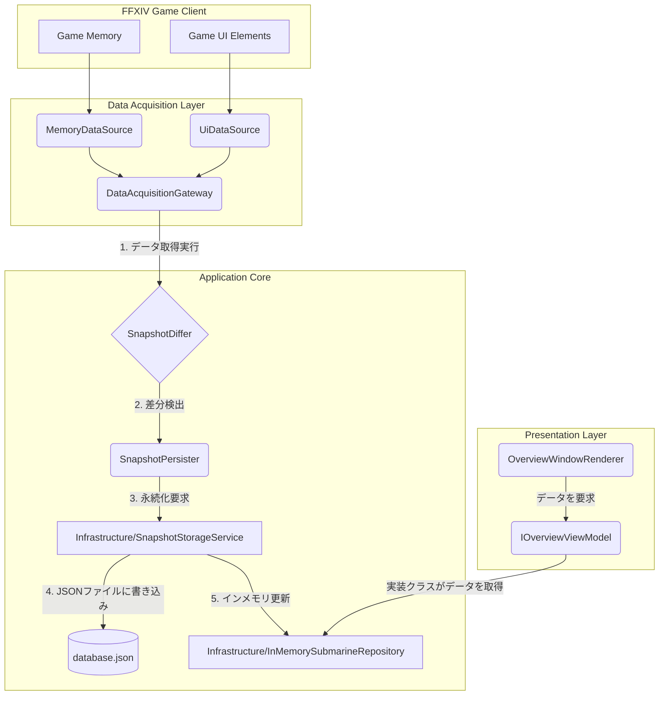

# XIVSubmarinesRewrite プロジェクト概要

このドキュメントは、`XIVSubmarinesRewrite` プロジェクトの全体像を、後続のAI開発者が理解しやすいようにまとめたものです。

## 1. アーキテクチャ概要

本プロジェクトは、Dalamudプラグインとして、**クリーンアーキテクチャ**の原則に厳密に従って設計されています。これにより、関心事の分離が徹底され、ビジネスロジック（ドメイン）がUIやデータ永続化などの技術的詳細から完全に独立しています。

主要な構成要素は以下の4つのレイヤーに分かれています。

-   **Domain**: コアとなるビジネスロジックとモデル、リポジトリのインターフェースを定義します。
-   **Application**: ドメインのユースケースを実装し、アプリケーション固有のロジックを調整します。
-   **Infrastructure**: 外部ライブラリ、データ永続化、外部APIクライアントなど、具体的な技術を実装します。
-   **Presentation**: ユーザーインターフェース（UI）のレンダリングとユーザー入力を担当します。

依存関係は一方向に流れ（Presentation → Application → Domain, Infrastructure → Application → Domain）、`PluginBootstrapper.cs` がDIコンテナ（Composition Root）として機能し、起動時にすべての依存関係を解決・注入します。

データ永続化戦略は、**インメモリキャッシュとJSONファイルによる永続化**のハイブリッドアプローチを採用しています。アプリケーションは高速なインメモリリポジトリに対して動作し、変更は定期的にJSONファイルに書き込まれます。

## 2. 主要モジュール構成

プロジェクトのソースコードは `src/` ディレクトリ配下にあり、各レイヤーが明確なフォルダ構造で表現されています。

-   `src/Domain`:
    -   `Models`: `Submarine`, `Voyage` といったコアビジネスエンティティ。
    -   `Repositories`: `ISubmarineRepository` など、データアクセスロジックの契約（インターフェース）を定義。

-   `src/Application`:
    -   `Commands`, `Queries`: CQRSパターンに似たオブジェクトで、アプリケーションの操作を定義。
    -   `Services`: `SnapshotOrchestrator`, `NotificationCoordinator` など、複数のリポジトリやサービスを組み合わせたユースケースを実装。

-   `src/Infrastructure`:
    -   `Persistence`: `SnapshotStorageService` がJSONファイルへのデータ読み書きを実装。
    -   `Repositories`: `InMemorySubmarineRepository` のように、Domain層のインターフェースを具象クラスとして実装。
    -   `Acquisition`: `DalamudMemorySubmarineSnapshotSource` など、FFXIVのゲームメモリやUIからデータを取得するロジック。
    -   `Composition`: `PluginBootstrapper.cs` がDIコンテナとして機能。
    -   `Notifications`: `DiscordWebhookClient` など、外部通知サービスとの連携。

-   `src/Presentation`:
    -   `Rendering`: `OverviewWindowRenderer` など、ImGuiを使用したウィンドウの描画ロジック。
    -   `ViewModels`: UIの状態を管理し、描画ロジックにデータを提供するViewModel。
    -   `UIStateObserver`: UIの状態変更を監視し、イベントを通知する。

## 3. データフロー図

主要なデータフローは、ゲーム内データの取得から永続化、UI表示までの一連のプロセスです。



1.  `DataAcquisitionGateway` が `MemoryDataSource` と `UiDataSource` を通じてゲーム内からデータを収集します。
2.  `SnapshotDiffer` が現在のインメモリキャッシュと取得したデータの差分を検出します。
3.  差分がある場合、`SnapshotPersister` が `SnapshotStorageService` を呼び出します。
4.  `SnapshotStorageService` は差分をJSONファイルに書き込み、永続化します。
5.  同時に、`InMemorySubmarineRepository` の状態も更新されます。
6.  UI (`OverviewWindowRenderer`) はViewModelを通じて `InMemorySubmarineRepository` から最新のデータを取得し、画面に描画します。

## 4. API仕様

このプロジェクトは外部に公開されたWeb API（REST, GraphQLなど）を持ちません。APIは内部的なものに限定されます。

-   **プラグイン内部API**:
    各レイヤー間の連携は、C#のインターフェースによって定義されます。これらが事実上の内部APIとして機能します。
    -   `ISubmarineRepository`: 潜水艦データへのアクセスを提供。
    -   `ISettingsProvider`: 設定の読み書きを提供。
    -   `IDiscordClient`: Discordへの通知機能を提供。
-   **Dalamud Framework API**:
    `Plugin.cs` がDalamudフレームワークのAPIを呼び出し、プラグインをゲームクライアントに統合します。
    -   `Framework.Update`: フレーム毎の更新処理をフック。
    -   `PluginInterface.UiBuilder.Draw`: UI描画処理をフック。

## 5. 依存関係リスト

#### C# / .NET (`XIVSubmarinesRewrite.csproj`)

-   **フレームワーク**: .NET 9.0
-   **Dalamud Core**:
    -   `Dalamud.dll`
    -   `Dalamud.Bindings.ImGui.dll`
    -   `FFXIVClientStructs.dll`
    -   `InteropGenerator.Runtime.dll`
    -   `Lumina.dll`
    -   `Lumina.Excel.dll`
-   **ビルドツール**:
    -   `DalamudPackager`

#### JavaScript / Node.js (`tests/Playwright/package.json`)

-   **テストフレームワーク**:
    -   `@playwright/test`

## 6. セットアップ手順

1.  **前提条件**:
    -   .NET 9 SDK
    -   Node.js (テスト実行のため)
    -   FFXIVとXIVLauncherがインストール済みであること。

2.  **リポジトリのクローン**:
    ```bash
    git clone <repository_url>
    cd XIVSubmarinesRewrite
    ```

3.  **Dalamudライブラリのパス設定**:
    プロジェクトルートに `Local.props` ファイルを作成し、Dalamudライブラリへのパスを設定します。
    ```xml
    <?xml version="1.0" encoding="utf-8"?>
    <Project>
      <PropertyGroup>
        <DalamudLibPath>C:\Users\YourUser\AppData\Roaming\XIVLauncher\addon\Hooks\dev</DalamudLibPath>
      </PropertyGroup>
    </Project>
    ```
    `DalamudLibPath` は自身の環境に合わせて変更してください。

4.  **ビルド**:
    ```bash
    dotnet build
    ```
    ビルドが成功すると、プラグインDLLが `$(APPDATA)\XIVLauncher\devPlugins\XIVSubmarinesRewrite` に自動でコピーされます。

5.  **実行**:
    XIVLauncherを起動し、インゲームコマンド `/xlplugins` を実行してプラグインを有効化します。

## 7. テスト戦略

-   **単体テスト・結合テスト**:
    -   `tests/XIVSubmarinesRewrite.Tests/` ディレクトリに配置。
    -   xUnit（または同様の.NETテストフレームワーク）を使用。
    -   ビジネスロジック、ViewModel、フォーマッタなどがテスト対象。

-   **UIテスト / E2Eテスト**:
    -   `tests/Playwright/` ディレクトリに配置。
    -   **Playwright** を使用して、実際のUIコンポーネントの表示やインタラクションをテスト。
    -   `npm install` で依存関係をインストール後、`npm test` で実行。
    -   UIのレスポンシブデザイン、テーマ変更、主要なウィンドウの表示確認などが含まれます。

## 8. 運用ガイドライン

-   **デプロイ**:
    -   GitHub Actionsの `release.yml` ワークフローによって、リリースタグが作成されると自動でビルドとパッケージングが行われます。
    -   `DalamudPackager` がDalamudリポジトリに提出可能なzipファイルを生成します。

-   **ロギング**:
    -   プラグインはDalamudのロギング機構を利用します。ログはDalamudのログファイルに出力されます。
    -   `Infrastructure/Logging` フォルダにロギング関連の実装があります。

-   **設定**:
    -   プラグインの設定は `DalamudJsonSettingsProvider` を通じてJSONファイルとして保存されます。
    -   ファイルは通常 `$(APPDATA)\XIVLauncher\pluginConfigs` ディレクトリに保存されます。

-   **データ**:
    -   潜水艦のデータは `database.json` のようなファイル名で、設定とは別の場所に保存されます。
    -   データのバックアップや移行が必要な場合は、このJSONファイルを操作します。
